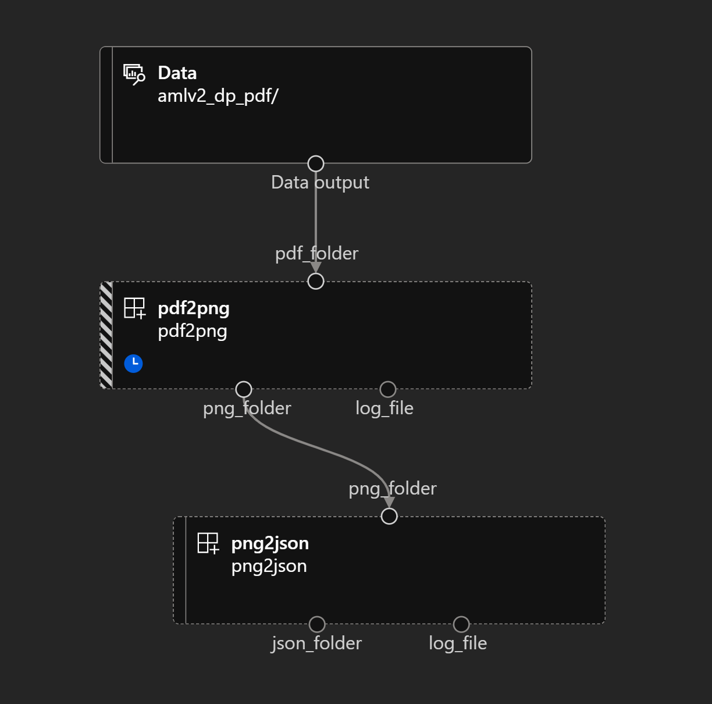

# azureml-v2-documents-processing

# Project intent

This is an Azure ML CLIv2 template project demonstrating the use of the parallel job type to do large scale documents processing.

We here have a simple pipeline with 2 steps:
- pdf2png:
	- input: folder containing a set of (pdf) documents to process
	- output: one png file per pdf page
- png2json:
	- input: folder of png files
	- output: json output of the Azure FormRecognizer 'document' model (analyses a document and extracts all key/value pairs, tables, etc. automatically)

Add as many steps as needed, calling different Cognitive Services (for instance Vision, OCR, etc) or your own deployed Azure ML models (as Managed Online Endpoints or inline by loading the model in memory in the 'init()' method of each step).



Each step is configured with a different level of parallelism, and could potentially use a different compute (configuration here is to use the same AzureML Compute Cluster called 'cpu-cluster'). See the control parameters for retries, timeouts, etc. in the pipeline.yml file.

For more details check [How to use parallel job in pipeline (V2)](https://learn.microsoft.com/en-us/azure/machine-learning/how-to-use-parallel-job-in-pipeline?tabs=cliv2)

## How to create and run the pipeline

[Install the Azure CLI + the Azure CLI 'ml' extension](https://docs.microsoft.com/en-us/azure/machine-learning/how-to-configure-cli?tabs=public), then run the following to create the steps runtime environment (repeat this any time you need to modify the 'conda' files in each step folder to support code changes):

Create the 2 environments supporting each pipeline step (we could have used a single environment for both steps but it is best practice to have a specific runtime per task/step as they tend to eventually diverge and use different packages/versions; if these environments happened to be the same, it would be detected and would only create one backend image anyway):
```
az ml environment create -f png2json/environment.yml
az ml environment create -f pdf2png/environment.yml
```
To trigger a pipeline creation/run, run the following:

```
az ml job create -f pipeline.yml
```
Then go to the Azure portal to monitor your pipeline.